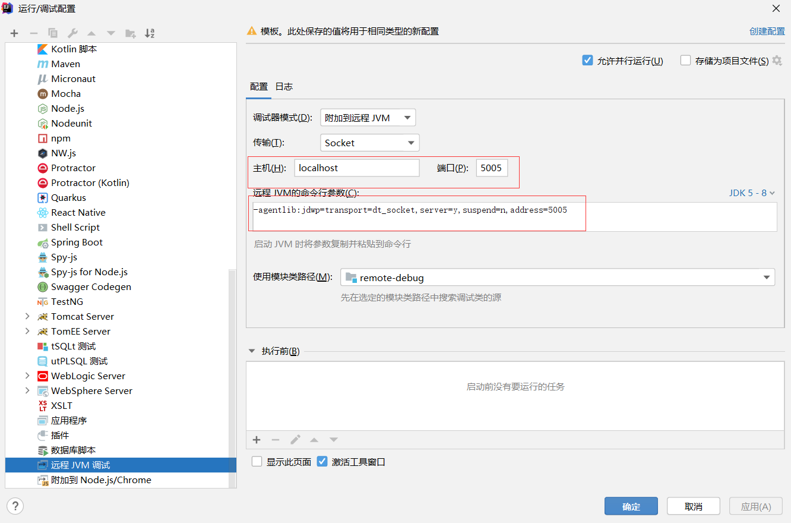

# IDEA 远程调试 jar 包


# 1. jar 包启动

```
java -Xdebug -Xrunjdwp:transport=dt_socket,address=5005,server=y,suspend=n -jar remote-debug-0.0.1-SNAPSHOT.jar
```

# 2. IDEA 配置远程调试




# 3. 远程调试测试

浏览器输入 : http://localhost:8080

